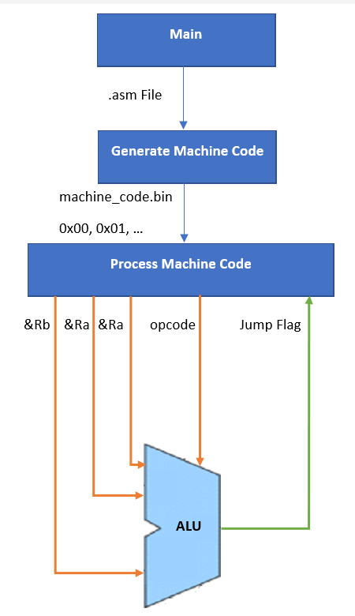

# Building and Running the ISA

To simulate different ISA scripts, you should use the console to select which one you want to use. The console arguments passed are used as the **.asm** script to compile, build, and execute. To run some example scripts, follow the steps below.

1) `cd ISA` - go to the ISA directory
2) `g++ main.cpp -o main` - to compile into an executable **main.exe**.
3) `./main.exe examples/pi.asm` - run the executable with **./main.exe**. Specify the script to run with the relative path like **./examples/pi.asm** or **./examples/for-loop.asm**. There are more examples provided.

When running scripts that use floats, I would suggest using this online [Hex-Float Converter](https://gregstoll.com/~gregstoll/floattohex/) to confirm the accuracy of the program.

# High Level Architecture

# Instructions

## R-Type
### mathematical operations

* addi
* addf
* subi
* subf
* muli
* mulf
* divi
* divf

### logical operations

* not
* and
* nand
* or
* nor
* xor
* xnor

## J-Type

### jumping and branching operations

* jump
* beq
* bne

## I-Type

### immediate operations

* loadi
* loadf

## L-Type

### label operations

* label_name **:**

# Uses

## Options

`0x` - Print hexadecimal when using the `console(rX)` function.
`0b` - Print the 32 bit binary when using the `console(rX)` function.

## Memory

`loadf(r1, 3.14159)` -  Load a float into register 1.
`loadi(r1, 54)` - Load an integer into register 1.

## Mathematics 

`addi(r3, r1, r2)` -  Performs integer addition operation using registers 1 and 2 and stores the value in register 3.
`divf(r1, r2, r3)` -  Performs floating point division operation using registers 2 and 3 and stores the value in register 3.
`console(r1)` - Print the value inside register 1. Binary or hex will be printed depending on if you specified `0x` or `0b` as the first command.

## Boolean Logic

`or(r1, r2, r3)` - Perform a OR operation using the values inside registers 2 and 3, storing it register 1.
`and(r1, r2, r3)` - Perform a AND operation using the values inside registers 2 and 3, storing it register 1.
`xor(r1, r2, r3)` - Perform a XOR operation using the values inside registers 2 and 3, storing it register 1.
`not(r1)` - Perform a NOT operation on the value inside register r1. 

## Branching

`my_label:` - Create a new label called "my_label". The software enumerates each label and assigns an instruction pointer to it.
`jump(my_label)` - Unconditionally jump to label "my_label". There is no conditional justification to the jump. It's just a jump.
`beq(r1, r2, my_label)` - Jump to the label "my_label" if the data inside the two registers are identical.
`bne(r1, r2, my_label)` - Jump to the label "my_label" if the data inside the two registers are not identical.